# AI Trading Agent Architecture

This document outlines the architecture of the AI Trading Agent, a Python-based system designed for automated stock trading. The system now includes an intelligent two-stage screening process and a resilient API key rotation system to ensure continuous operation.

## Mermaid Diagram

```mermaid
graph TD
    subgraph "Core Application"
        A[User starts main.py] --> B{Validate Config}
        B -- ✅ Valid --> C[Initialize Services]
        C --> D((Trading Loop))
    end

    subgraph "Services & State"
        S1[state.py]
        S2[errors.py]
        S3[circuit_breaker.py]
        S4[logger.py]
        L1[tradelog.csv]
        S5[validators.py]
        S6[analysis.py: Key Manager]
    end
    
    C --> S1; C --> S2; C --> S3; C --> S4; C --> S5; C --> S6;

    subgraph "Main Trading Cycle"
        D --> F{Is Market Open?}
        F -- Yes --> P1[Phase 1: Position Review]
        P1 --> P2[Phase 2: Manage Holdings]
        P2 --> P3[Phase 3: Find Opportunities]
        P3 --> K[Log & Report Summary]
        K --> D
        F -- No --> D
    end

    subgraph "Opportunity Funnel (Phase 3)"
        P3 --> QS[screener.py: Quantitative Filter]
        QS --> |All Candidates| RS[screener.py: Rank & Score]
        RS --> |Top 5| AN[analysis.py: LLM Analysis]
    end

    subgraph "Data & Execution Layer"
        MD[market_data.py]
        TE[trade_executor.py]
        KITE[Broker API]
        GEMINI[Gemini API]
    end
    
    P1 --> MD; P2 --> MD; QS --> MD;
    AN --> |API Call| GEMINI
    S6 --> |Rotates Key| GEMINI
    AN --> TE
    TE -->|Place & Confirm| KITE
    
    subgraph "User Interaction"
        U[User]
    end
    
    U -->|Telegram| D
    D -->|Telegram| U

    %% Styling
    classDef servicesBox fill:#00000,stroke:#333,stroke-width:1px
    classDef tradingBox fill:#00000,stroke:#333,stroke-width:1px
    classDef dataBox fill:#00000,stroke:#333,stroke-width:1px
    classDef userBox fill:#00000,stroke:#333,stroke-width:1px
    
    class S1,S2,S3,S4,S5,L1,S6 servicesBox
    class D,F,P1,P2,P3,K,QS,RS tradingBox
    class MD,AN,TE,KITE,GEMINI dataBox
    class U userBox
```

## Key Architectural Changes

### 1. Intelligent Two-Stage Screener
To operate within the free tier limits of the Gemini API, the opportunity discovery process has been redesigned into a funnel:
- **Quantitative Filtering:** The `screener.py` module first scans the entire market index (e.g., NIFTY 100) and filters for all stocks that meet basic, quantitative criteria (e.g., price > 50-day SMA, RSI < 55). This is done locally and is computationally cheap.
- **Ranking & Scoring:** The candidates that pass the initial filter are then scored and ranked based on how well they fit the strategy (e.g., a lower RSI gets a higher score).
- **LLM Analysis:** Only the **top 5** highest-scoring candidates are sent to the Gemini API for the final, qualitative analysis. This drastically reduces API call volume from ~80-100 per cycle to a maximum of 5, ensuring the agent stays within daily free tier limits.

### 2. Resilient API Key Rotation
The agent is no longer dependent on a single API key.
- The `analysis.py` module now contains a `GeminiKeyManager`.
- On startup, it reads a comma-separated list of API keys from the `GEMINI_API_KEYS` variable in the `.env` file.
- If an API call fails with a rate limit error (429), the manager automatically and seamlessly rotates to the next key in the list and retries the request.
- This allows the agent to continue operating even if one or more keys have exhausted their daily free tier quota.
