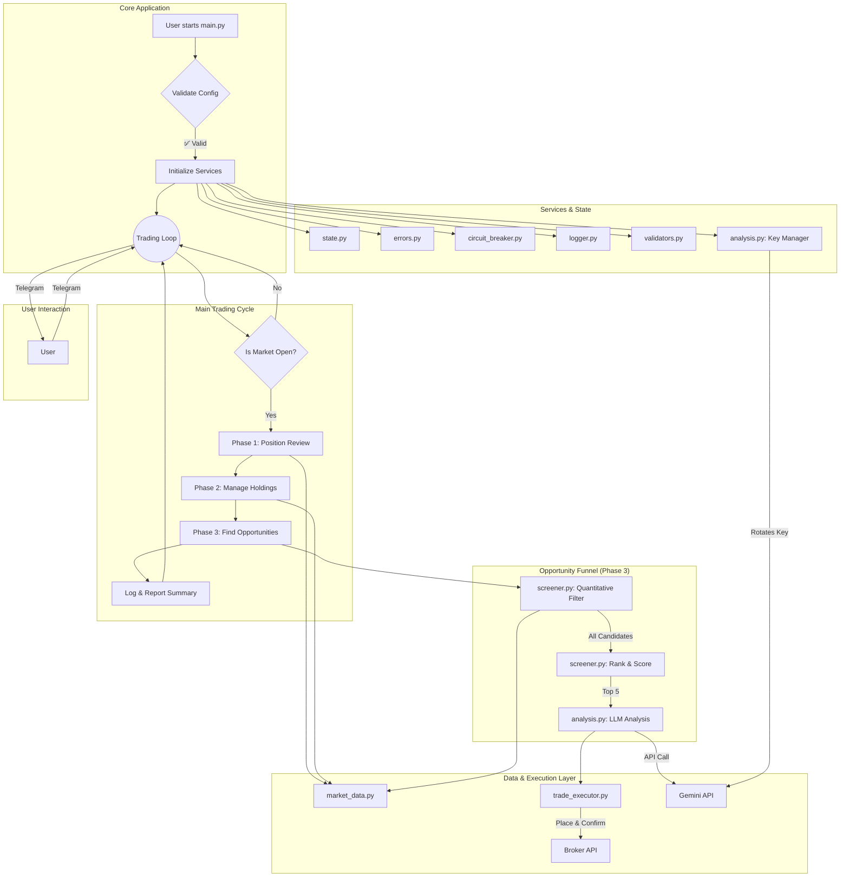

# AI Trading Agent

A sophisticated, AI-powered swing trading agent designed to operate on the Indian stock market (NSE). It uses a Large Language Model (LLM) for its core trading decisions, is integrated with the Zerodha Kite API for live data and trade execution, and is fully controllable via a Telegram bot.

**This is an experimental project. Trading in financial markets involves substantial risk. You are solely responsible for any financial decisions and potential losses. It is highly recommended to run this agent in a paper trading environment before deploying it with real capital.**

## Core Trading Strategy

The agent employs a multi-layered swing trading strategy designed to identify and act on high-probability momentum-based opportunities.

1.  **Intelligent Two-Stage Screening**: To maximize efficiency and stay within API rate limits, the agent uses a funnel approach:
    *   **Quantitative Filtering**: It first scans a broad market index (e.g., NIFTY 100) for all stocks that meet basic, quantitative criteria (e.g., price > 50-day SMA, RSI < 55).
    *   **Ranking & Scoring**: These candidates are then scored and ranked locally based on how strongly they exhibit pullback characteristics (a lower RSI gets a higher score).
    *   **AI-Powered Analysis**: Only the **top 5** highest-scoring opportunities are sent to the configured LLM for a final, qualitative decision. This focuses the AI's analysis on the most promising candidates.
2.  **Intelligent Exit Conditions**:
    - **Volatility-Adjusted Trailing Stop-Loss**: The primary risk management tool, dynamically calculated using the **Average True Range (ATR)** to adapt to each stock's unique volatility.
    - **Active Position Review**: The agent doesn't just "set and forget." It periodically re-evaluates all open positions for signs of weakness, such as technical reversals, price stagnation, or simply being held for too long (time-stop).
    - **Confirmation-Based Take-Profit**: To avoid selling too early, the agent requires two conditions to be met: the stock must be overbought (RSI > 70) **and** show price weakness.

## System Architecture

The agent is designed for resilience and transparency. The core logic is a trading loop that, when the market is open, reviews existing positions, manages holdings, and finds new opportunities.



## Getting Started

### 1. Prerequisites
- Python 3.10+
- A Zerodha Kite developer account
- An API key from an LLM provider (e.g., Google Gemini, Perplexity)
- A Telegram account and a bot token

### 2. Clone the Repository
```bash
git clone <repository_url>
cd ai_trading_agent
```

### 3. Create and Activate a Virtual Environment
```bash
# For Windows
python -m venv .venv
.\.venv\Scripts\activate

# For macOS/Linux
python3 -m venv .venv
source .venv/bin/activate
```

### 4. Install Dependencies
```bash
pip install -r requirements.txt
```

### 5. Configure Environment Variables
Create a file named `.env` in the root directory and add the following, replacing the placeholder values with your actual credentials.

```env
# Zerodha Kite API Credentials
KITE_API_KEY="your_kite_api_key"
ACCESS_TOKEN="your_kite_access_token" # This needs to be generated daily

# --- LLM Configuration ---
# LLM_PROVIDER can be "gemini" or "perplexity"
LLM_PROVIDER="gemini"

# --- Gemini API Key(s) ---
# For a single key, use GEMINI_API_KEY="your_key"
# For multiple keys (to bypass daily free tier limits), use a comma-separated list.
# IMPORTANT: Each key must come from a separate Google Cloud Project.
GEMINI_API_KEYS="key_from_project_A,key_from_project_B,key_from_project_C"

# --- Perplexity API Token ---
PERPLEXITY_API_TOKEN="your_perplexity_api_token"

# Telegram Bot Credentials
TELEGRAM_BOT_TOKEN="your_telegram_bot_token"
TELEGRAM_CHAT_ID="your_telegram_chat_id"
```

The agent's strategy and risk parameters can be fine-tuned in `src/config.py`.

## Usage

### 1. Authenticate with Broker (Daily)
Run the authentication script and follow the prompts. This will save your `access_token` to the `.env` file.
```bash
python src/authenticate.py
```

### 2. Start the Main Agent
Once authenticated, run the main script:
```bash
python src/main.py
```
The agent will start, validate all API keys, and send you a startup message on Telegram.

## Operational Tools

These tools should be run from the root `ai_trading_agent` directory in a separate terminal while the main agent is running.

### Real-Time Monitoring Dashboard
To get a live view of your portfolio and recent activity:
```bash
python src/dashboard.py
```

### Broker Reconciliation
To compare the agent's trade log with your broker's statement (e.g., `trades.csv`):
```bash
python src/reconcile.py path/to/your/broker_statement.csv
```

## Disclaimer

This trading agent is provided for educational purposes only. Trading and investing in financial markets involve substantial risk. You are solely responsible for any financial decisions you make. The author and contributors are not liable for any losses you may incur. Always do your own research and consider running the agent in a paper trading environment before deploying it with real capital.